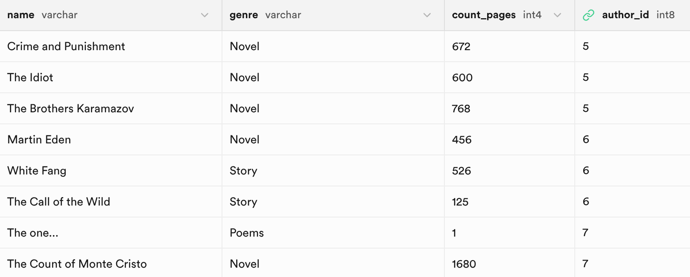

## Introduction
Once you’ve created your data models, **Supadantic** automatically gives you a database-abstraction API that lets you create, retrieve, update and delete objects with filters.

Throughout this guide we’ll refer to the following models:
```python
from supadantic.models import BaseSBModel

class Author(BaseSBModel):
    name: str
    surname: str
    age: int
    nationality: str


class Book(BaseSBModel):
    name: str
    genre: str
    count_pages: int | None = None
    author_id: int
```

And the following data for:

**Author**

**Book**


If you don't know how to create the data via **supadantic**, check it out [here](https://makridenko.github.io/supadantic/models/base_sb_model/?h=save#supadantic.models.BaseSBModel.save).

## Retrieving objects
To retrieve objects from your database, construct a [QuerySet](https://makridenko.github.io/supadantic/q_set/) on your model class.

A [QuerySet](https://makridenko.github.io/supadantic/q_set/) represents a collection of objects from your database. **It can have zero, one or many filters**.

### Retrieving all objects
```python
authors = Author.objects.all()
```

### Retrieving a single object with `get()` method
```python
jack_london = Author.objects.get(name="Jack London")
```

### Retrieving specific objects with `filter()` and `exclude()` methods
If you want to select only a subset of the complete set of objects, you refine the initial [QuerySet](https://makridenko.github.io/supadantic/q_set/), adding filter conditions. The two most common ways to refine a [QuerySet](https://makridenko.github.io/supadantic/q_set/) are:

- **filter(\*\*kwargs)** — returns a new [QuerySet](https://makridenko.github.io/supadantic/q_set/) containing objects that **match the given lookup parameters**.
- **exclude(\*\*kwargs)** — returns a new [QuerySet](https://makridenko.github.io/supadantic/q_set/) containing objects that **do not match the given lookup parameters**.

The lookup parameters (**\*\*kwargs** in the above function definitions) should be in the following format `field__lookuptype=value` (**double-underscore**), for example:
```python
authors = Author.objects.filter(age__gt=50)
```

#### `Equal` and `Not Equal` filters
```python
books = Book.objects.filter(name="The Idiot")
```
> Note that the **non-equality filter** is implemented through the `exclude` method.

```python
books = Book.objects.exclude(name="The Idiot")
```

#### `Greater Than` and `Greater Than Or Equal` filters
```python
books = Book.objects.filter(count_pages__gt=600) # 600 is not included

books = Book.objects.filter(count_pages__gte=600) # 600 is included
```

`Exclude` method will be the opposite of this methods:
```python
books = Book.objects.exclude(count_pages__gt=600) # it will have the logic of lte (less than or equal) filter

books = Book.objects.exclude(count_pages__gte=600) # it will have the logic of lt (less than) filter
```

####  `Less Than` and `Less Than Or Equal` filters
```python
authors = Author.objects.filter(id__lt=6) # 6 is not included

authors = Author.objects.filter(id__lte=6) # 6 is included
```

`Exclude` method will be the opposite of this methods:
```python
authors = Author.objects.exclude(id__lt=6) # it will have the logic of gte (greater than or equal) filter

authors = Author.objects.exclude(id__lte=6) # it will have the logic of gt (greater than) filter
```

#### `Include` filter
```python
books = User.objects.filter(genre__in=["Novel", "Poems"])
```

### Chaining filters
The result of refining a [QuerySet](https://makridenko.github.io/supadantic/q_set/) is itself a [QuerySet](https://makridenko.github.io/supadantic/q_set/), so it’s possible to chain refinements together. For example:
```python
books = (
    Book.objects
        .filter(genre="Novel")
        .filter(count_pages__gt=600)
        .filter(author_id=5)
)
```
